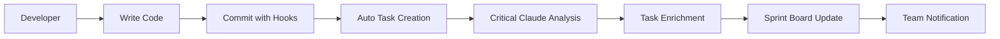

# 🚀 Critical Claude Backlog: AI-Powered AGILE Task Management

## 🎯 Vision
Fork Backlog.md and enhance it with Critical Claude's AI capabilities to create the most intelligent task management system for development teams. Combine markdown simplicity with AI-powered planning, automated task creation, and real-time code analysis.

## 🏗️ Architecture Overview

```
┌─────────────────────────────────────────┐
│             Claude Code Hooks           │ (Automated Task Creation)
├─────────────────────────────────────────┤
│          Critical Claude MCP            │ (AI Planning & Analysis)
├─────────────────────────────────────────┤
│         Enhanced Backlog CLI            │ (Extended Commands)
├─────────────────────────────────────────┤
│       AGILE Hierarchy Engine            │ (Phase>Epic>Sprint>Task)
├─────────────────────────────────────────┤
│        Markdown File System             │ (Existing Backlog.md)
└─────────────────────────────────────────┘
```

## 📋 Core Features

### 🤖 AI-Powered Planning
- **Intelligent Task Breakdown**: Use `cc_mvp_plan` to break features into tasks
- **Effort Estimation**: Leverage Critical Claude's realistic timeline generation
- **Sprint Planning**: AI-assisted sprint capacity and task distribution
- **Architecture Analysis**: Automatic task creation from `cc_system_design_analyze`

### 🏃‍♂️ AGILE Methodology
```
Phase (Quarter/Release)
└── Epic (Major Feature)
    └── Sprint (2-week iteration)
        └── Task (Atomic work unit)
```

### 🔄 Automated Workflows
- **Git Hooks**: Auto-create tasks from commit patterns
- **PR Analysis**: Generate code review tasks automatically
- **CI/CD Integration**: Create tasks for failing builds/tests
- **Documentation**: Auto-generate documentation tasks

## 🛠️ Implementation Plan

### Phase 1: Foundation (Weeks 1-3)
**Goal**: Fork and set up basic Critical Claude integration

#### Week 1: Repository Setup
```bash
# Fork and clone
git clone https://github.com/YourOrg/critical-claude-backlog.git
cd critical-claude-backlog

# Add Critical Claude as dependency
npm install @critical-claude/core @critical-claude/system-design @critical-claude/data-flow
```

#### Week 2-3: MCP Integration Layer
```typescript
// src/critical-claude/mcp-client.ts
import { SystemDesignServer } from '@critical-claude/system-design';
import { DataFlowServer } from '@critical-claude/data-flow';

export class CriticalClaudeClient {
  private systemDesign: SystemDesignServer;
  private dataFlow: DataFlowServer;
  
  constructor() {
    this.systemDesign = new SystemDesignServer();
    this.dataFlow = new DataFlowServer();
  }
  
  async generateTasksFromFeature(description: string): Promise<Task[]> {
    const mvpPlan = await this.systemDesign.handleToolCall('cc_mvp_plan', {
      projectName: 'Current Project',
      description,
      targetUsers: 'Development team',
      constraints: { teamSize: 2, timeline: '2 weeks' }
    });
    
    return this.convertPlanToTasks(mvpPlan);
  }
  
  async analyzeCodeForTasks(filePath: string): Promise<Task[]> {
    const analysis = await this.systemDesign.handleToolCall('cc_crit_code', {
      filePath
    });
    
    return this.convertAnalysisToTasks(analysis);
  }
}
```

### Phase 2: AGILE Hierarchy (Weeks 4-6)
**Goal**: Implement Phase>Epic>Sprint>Task structure

#### Enhanced Data Models
```typescript
// src/models/agile.ts
export interface Phase {
  id: string;
  name: string;
  description: string;
  startDate: Date;
  endDate: Date;
  status: 'planning' | 'active' | 'completed';
  epics: Epic[];
}

export interface Epic {
  id: string;
  phaseId: string;
  name: string;
  description: string;
  businessValue: string;
  acceptanceCriteria: string[];
  sprints: Sprint[];
  estimatedEffort: number; // story points
}

export interface Sprint {
  id: string;
  epicId: string;
  name: string;
  goal: string;
  startDate: Date;
  endDate: Date;
  capacity: number; // story points
  tasks: Task[];
  status: 'planning' | 'active' | 'review' | 'completed';
}

export interface EnhancedTask extends Task {
  sprintId?: string;
  storyPoints: number;
  acceptanceCriteria: string[];
  dependencies: string[];
  notes: string[];
  codeReferences: string[]; // file paths
  generatedBy?: 'manual' | 'ai' | 'hook';
}
```

#### CLI Commands
```bash
# AGILE Hierarchy Management
backlog agile phase create "Q1 2024 Release" -d "First quarter objectives"
backlog agile epic create "User Authentication" --phase phase-1 -v "Enable secure user access"
backlog agile sprint create "Sprint 1" --epic epic-1 --capacity 20
backlog task create "Implement JWT tokens" --sprint sprint-1 --points 5 --ac "Must be secure,Must expire"

# AI-Powered Planning
backlog cc-plan "Add OAuth integration with Google and GitHub"
backlog cc-analyze src/auth/login.ts
backlog cc-sprint-plan --sprint sprint-1

# Enhanced Task Management (all existing Backlog.md commands + new ones)
backlog task create "Feature" -d "Description" -a @sara -s "To Do" -l auth --priority high --ac "Must work" --notes "Initial setup" --dep task-1 --sprint sprint-1 --points 3
```

### Phase 3: Claude Code Hooks (Weeks 7-9)
**Goal**: Automated task creation from development workflows

#### Hooks Configuration
```yaml
# .claude/hooks.yml
on:
  commit:
    - pattern: "fix:|bug:"
      action: create_task
      template: "Fix: {commit_message}"
      sprint: current
      priority: high
      labels: [bug]
    
    - pattern: "feat:|feature:"
      action: analyze_with_cc
      tools: [cc_mvp_plan, cc_system_design_analyze]
      auto_create_tasks: true
  
  pr:
    opened:
      action: create_review_tasks
      assignee: "@team-lead"
      priority: medium
    
    files_changed:
      - pattern: "*.ts"
        action: cc_crit_code_analysis
        auto_create_issues: true

  ci:
    failure:
      action: create_task
      template: "Fix CI failure: {job_name}"
      priority: critical
      assignee: "{commit_author}"
```

#### Hook Implementation
```typescript
// src/hooks/claude-hooks.ts
export class ClaudeHooksProcessor {
  constructor(
    private backlog: BacklogManager,
    private criticalClaude: CriticalClaudeClient
  ) {}
  
  async processCommit(commit: GitCommit): Promise<void> {
    if (commit.message.includes('fix:') || commit.message.includes('bug:')) {
      await this.createBugTask(commit);
    }
    
    if (commit.message.includes('feat:')) {
      const tasks = await this.criticalClaude.generateTasksFromFeature(
        commit.message
      );
      await this.backlog.addTasks(tasks);
    }
    
    // Analyze changed files
    for (const file of commit.changedFiles) {
      if (file.endsWith('.ts') || file.endsWith('.js')) {
        const analysisTask = await this.criticalClaude.analyzeCodeForTasks(file);
        await this.backlog.addTasks(analysisTask);
      }
    }
  }
  
  async processPullRequest(pr: PullRequest): Promise<void> {
    // Create code review tasks
    const reviewTask = await this.createReviewTask(pr);
    
    // Analyze architectural impact
    if (pr.changedFiles.length > 5) {
      const impactAnalysis = await this.criticalClaude.analyzeArchitecturalImpact(
        pr.changedFiles
      );
      await this.backlog.addTasks(impactAnalysis.suggestedTasks);
    }
  }
}
```

### Phase 4: Web Interface Enhancement (Weeks 10-12)
**Goal**: Enhanced UI for AGILE workflows and AI features

#### Enhanced Dashboard
```tsx
// src/web/components/AgileBoard.tsx
export const AgileBoard: React.FC = () => {
  const [currentSprint, setCurrentSprint] = useState<Sprint>();
  const [burndownData, setBurndownData] = useState<BurndownData>();
  
  return (
    <div className="agile-board">
      <SprintHeader sprint={currentSprint} />
      <div className="board-columns">
        <TaskColumn status="To Do" tasks={todoTasks} />
        <TaskColumn status="In Progress" tasks={inProgressTasks} />
        <TaskColumn status="Review" tasks={reviewTasks} />
        <TaskColumn status="Done" tasks={doneTasks} />
      </div>
      <BurndownChart data={burndownData} />
      <AIInsights sprint={currentSprint} />
    </div>
  );
};

// AI-powered insights component
export const AIInsights: React.FC<{ sprint: Sprint }> = ({ sprint }) => {
  const [insights, setInsights] = useState<AIInsight[]>();
  
  useEffect(() => {
    // Get AI insights about sprint progress
    criticalClaude.analyzeSprintProgress(sprint).then(setInsights);
  }, [sprint]);
  
  return (
    <div className="ai-insights">
      <h3>🤖 AI Insights</h3>
      {insights?.map(insight => (
        <InsightCard key={insight.id} insight={insight} />
      ))}
    </div>
  );
};
```

## 🔧 Command Reference

### Core AGILE Commands
```bash
# Phase Management
backlog agile phase create "Q1 Release" -d "Description" --start 2024-01-01 --end 2024-03-31
backlog agile phase list
backlog agile phase edit phase-1 -d "Updated description"

# Epic Management  
backlog agile epic create "User System" --phase phase-1 -v "Business value statement"
backlog agile epic list --phase phase-1
backlog agile epic edit epic-1 --ac "New acceptance criteria"

# Sprint Management
backlog agile sprint create "Sprint 1" --epic epic-1 --capacity 25 --goal "Complete auth foundation"
backlog agile sprint start sprint-1
backlog agile sprint complete sprint-1
backlog agile sprint report sprint-1 (burndown, velocity, etc.)

# Enhanced Task Management
backlog task create "Implement OAuth" --sprint sprint-1 --points 8 --ac "Google OAuth,GitHub OAuth" --dep task-1,task-2
backlog task estimate task-1 --points 5 --confidence high
backlog task link task-1 --code src/auth/oauth.ts
```

### AI-Powered Commands
```bash
# Intelligent Planning
backlog cc-plan "Add user authentication system with social login"
backlog cc-analyze src/auth/ --create-tasks
backlog cc-sprint-plan --sprint sprint-1 --optimize
backlog cc-estimate task-1,task-2,task-3

# Code Analysis Integration  
backlog cc-review --pr 123 --create-tasks
backlog cc-tech-debt --scan src/ --priority high
backlog cc-architecture --analyze --suggest-improvements
```

### Hook Commands
```bash
# Hook Management
backlog hooks enable git-commit
backlog hooks enable pr-analysis  
backlog hooks config --edit
backlog hooks test --commit "feat: add new feature"
```

## 🚦 Integration Points

### 1. Critical Claude MCP Tools
- `cc_mvp_plan`: Feature breakdown into tasks
- `cc_system_design_analyze`: Architecture task generation  
- `cc_crit_code`: Code quality task creation
- `cc_data_flow_analyze`: Data flow improvement tasks

### 2. Claude Code Hooks
- **Pre-commit**: Code analysis and task validation
- **Post-commit**: Automated task creation from commit patterns
- **PR events**: Review task generation and impact analysis
- **CI/CD events**: Build failure task creation

### 3. Development Workflow


## 📊 Success Metrics

### Development Efficiency
- **Task Creation Speed**: 80% reduction in manual task creation
- **Planning Accuracy**: AI estimates within 20% of actual
- **Code Quality**: 50% reduction in bugs through automated analysis
- **Sprint Velocity**: 30% improvement in story point completion

### Team Adoption
- **Daily Active Users**: 90%+ of development team
- **Task Completion Rate**: 95%+ of sprint commitments
- **Automation Usage**: 70%+ of tasks created via AI/hooks
- **User Satisfaction**: 4.5/5 rating

## 🎯 Implementation Timeline

| Week | Focus | Deliverables |
|------|-------|-------------|
| 1-3 | Foundation | Fork, MCP integration, basic AI commands |
| 4-6 | AGILE Hierarchy | Phase/Epic/Sprint/Task models and CLI |
| 7-9 | Automation | Claude Code hooks and workflow integration |
| 10-12 | UI Enhancement | Web interface for AGILE workflows |
| 13-15 | Polish & Deploy | Documentation, testing, deployment |

## 🚀 Getting Started

1. **Fork Repository**
```bash
git clone https://github.com/YourOrg/critical-claude-backlog.git
cd critical-claude-backlog
npm install
```

2. **Configure Critical Claude**
```bash
# Install Critical Claude MCP tools
npm install @critical-claude/core @critical-claude/system-design

# Configure MCP connection
echo "mcp_server_url=http://localhost:3000" > .env
```

3. **Initialize AGILE Structure**
```bash
# Create your first phase
backlog agile phase create "Q1 2024" -d "First quarter development"

# Create an epic
backlog agile epic create "User Authentication" --phase phase-1

# Create a sprint
backlog agile sprint create "Sprint 1" --epic epic-1 --capacity 20

# Use AI to plan features
backlog cc-plan "Implement secure user authentication with OAuth support"
```

4. **Enable Hooks**
```bash
# Enable git hooks
backlog hooks enable git-commit

# Configure CI integration
backlog hooks enable ci-failure
```

## 💡 Advanced Features (Future)

### Phase 2 Enhancements
- **Real-time Collaboration**: Multi-user editing with conflict resolution
- **Advanced Analytics**: Predictive sprint planning, team performance insights
- **Custom MCP Tools**: Domain-specific analysis tools
- **Enterprise Integration**: JIRA sync, Slack notifications, SSO

### Phase 3 Intelligence
- **Predictive Planning**: ML-based sprint prediction and capacity planning
- **Code Impact Analysis**: Automated dependency and risk assessment
- **Smart Assignments**: AI-powered task assignment based on skills and workload
- **Quality Gates**: Automated quality checks and task validation

This architecture creates a next-generation task management system that combines the simplicity of markdown with the power of AI-driven development workflows. It's not just a tool—it's an intelligent development companion.

---

*"The best project management tool is the one that manages itself."* - Critical Claude