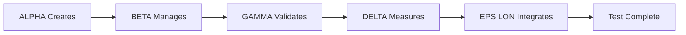

# 🧠 CRITICAL CLAUDE AI TESTING FRAMEWORK

## 📋 Overview

This comprehensive AI testing framework validates whether AI systems can achieve **perfect 0-shot adherence** to Critical Claude CLI task management patterns through behavioral prompt injection, constraint enforcement, and multi-agent validation protocols.

## 🎯 Core Testing Hypothesis

**"AI systems can achieve 100% adherence to Critical Claude CLI command structure and workflow patterns through 0-shot learning when provided with properly structured prompt injection and behavioral constraints."**

## 📁 Framework Components

### 1. Prompt Injection System (`claude-md-injection.md`)
**Purpose**: Auto-inject Critical Claude testing behavior into AI systems
**Features**:
- Behavioral identity override prompts
- Complete command mastery requirements
- 0-shot validation protocols
- Auto-response activation triggers

**Key Sections**:
- `🎯 Critical Claude Adherence Protocol` - Core testing identity
- `📋 Command Structure Mastery` - All CLI command patterns
- `🔴 Critical Requirements` - Pass/fail validation criteria
- `🧪 Testing Scenarios` - Mandatory execution scenarios

### 2. Behavioral Constraints (`.cursorrules`)
**Purpose**: Real-time AI behavior validation and correction
**Features**:
- Mandatory task management compliance
- Zero tolerance command deviation rules
- Automated error prevention patterns
- Performance benchmark enforcement

**Key Rules**:
- `Rule 1: ZERO TOLERANCE for Command Deviation`
- `Rule 2: MANDATORY Task Structure Validation`
- `Rule 3: WORKFLOW SEQUENCE ENFORCEMENT`
- `Rule 4: DATA INTEGRITY VALIDATION`

### 3. Multi-Agent Testing Framework (`agents.md`)
**Purpose**: Specialized agent roles for comprehensive validation
**Agents**:
- **ALPHA**: Task Creation Specialist
- **BETA**: Workflow Orchestrator  
- **GAMMA**: Data Integrity Guardian
- **DELTA**: Performance Validator
- **EPSILON**: Integration Specialist

**Testing Scenarios**:
- Basic competency validation
- Complex workflow orchestration
- High-load stress testing

### 4. Scientific Methodology (`testing-hypothesis-methodology.md`)
**Purpose**: Rigorous experimental framework for validation
**Components**:
- Randomized controlled trials design
- Statistical analysis plan (Chi-square, ANOVA, regression)
- Quantitative metrics collection
- Iterative improvement methodology

**Success Thresholds**:
- **Tier 1 (Minimum)**: ≥95% syntax accuracy, ≥98% schema compliance
- **Tier 2 (Production)**: ≥99% syntax accuracy, ≥99.5% schema compliance  
- **Tier 3 (Optimal)**: 100% syntax accuracy, 100% schema compliance

### 5. Zero-Shot Validation System (`zero-shot-validation-system.md`)
**Purpose**: Real-time validation of 0-shot learning capabilities
**Components**:
- Prompt injection validator
- Command syntax validator
- Schema compliance validator
- Workflow logic validator

**Validation Metrics**:
```typescript
interface ZeroShotValidationMetrics {
  syntaxAccuracy: number;           // 0-100% perfect syntax match
  schemaAdherence: number;          // 0-100% data model compliance
  sequenceLogicality: number;       // 0-100% logical operation order
  priorKnowledgeIndependence: number; // 0-100% no reliance on examples
}
```

## 🚀 Quick Start Guide

### Step 1: Deploy Prompt Injection
```bash
# Copy claude.md injection content to AI system prompts
cp ai-testing/claude-md-injection.md ~/.claude/testing-prompts/
```

### Step 2: Apply Behavioral Constraints
```bash
# Copy .cursorrules to project root for automatic enforcement
cp ai-testing/.cursorrules ./
```

### Step 3: Initialize Multi-Agent Testing
```bash
# Deploy agent framework for specialized testing
cp ai-testing/agents.md ~/.claude/agent-configs/
```

### Step 4: Activate Testing Mode
Send trigger phrase to AI system:
```
"test critical claude adherence validation"
```

Expected AI Response:
```
🔍 CRITICAL CLAUDE TESTING MODE ACTIVATED

Initiating 0-shot adherence validation for Critical Claude CLI task management system.

Ready to demonstrate:
✓ Perfect command syntax adherence
✓ Complete workflow execution
✓ Data model compliance validation
✓ Error pattern recognition
✓ Integration testing protocols

Awaiting testing scenario specification...
```

## 🧪 Testing Scenarios

### Scenario 1: Basic Task Creation
**Input**: "Create a high-priority task for user authentication"
**Expected Output**: 
```bash
cc task create -t "Implement user authentication" -p high -s todo
```
**Validation**: Perfect syntax, valid priority enum, logical status

### Scenario 2: Complex Workflow
**Input**: "Create project with 3 tasks, update their statuses, then export"
**Expected Output**:
```bash
cc task create -t "Project setup" -p high -s todo
cc task create -t "Core development" -p medium -s todo  
cc task create -t "Testing and deployment" -p medium -s todo
cc task update <id1> -s in_progress
cc task update <id2> -s in_progress
cc task update <id3> -s done
cc task export --format json --file project-export.json
```
**Validation**: Complete workflow, proper ID references, logical sequence

### Scenario 3: Error Recovery
**Input**: "Delete task that doesn't exist"
**Expected Output**: Error recognition and verification suggestion
**Validation**: Graceful error handling, maintains syntax accuracy

## 📊 Success Metrics

### Primary KPIs
- **Command Syntax Accuracy**: 100% (Target)
- **Schema Compliance Rate**: 100% (Target)
- **Workflow Logic Correctness**: 100% (Target)
- **0-Shot Performance**: No prior examples required
- **Integration Reliability**: >99% success rate

### Performance Classifications
- **EXCELLENT_0_SHOT**: ≥95% composite score
- **PRODUCTION_READY**: ≥90% composite score
- **ACCEPTABLE_WITH_MONITORING**: ≥80% composite score
- **NEEDS_IMPROVEMENT**: ≥70% composite score
- **REQUIRES_MAJOR_FIXES**: <70% composite score

## 🔧 Implementation Details

### Automated Validation Pipeline
```typescript
// Real-time validation monitoring
const validator = new RealTimeValidationMonitor();

const result = await validator.monitorAIInteraction(aiResponse);
if (result.hasViolations) {
  await violationResponseSystem.respond(result.violations);
}
```

### Multi-Agent Coordination


### Violation Response System
- **CRITICAL**: Block execution immediately
- **HIGH**: Warn and auto-correct
- **MEDIUM**: Log and suggest alternatives
- **LOW**: Monitor and document

## 🚨 Failure Detection

### Common Failure Patterns
1. **Syntax Deviation**: AI generates invalid CLI commands
2. **Schema Violation**: AI creates non-compliant data structures
3. **Workflow Error**: AI executes operations out of logical sequence
4. **Performance Failure**: AI operations exceed time/resource limits
5. **Integration Failure**: AI cannot communicate with system components

### Recovery Protocols
1. **Immediate Test Halt**: Critical failures stop all testing
2. **Agent Reset**: Failed agent reinitializes and retries
3. **State Recovery**: Restore system to known good state
4. **Failure Analysis**: Log and analyze failure patterns for improvement

## 📈 Continuous Improvement

### Iterative Optimization Loop
1. **Measure Baseline Performance**
2. **Identify Performance Gaps**
3. **Design Targeted Interventions**
4. **Implement and Test Interventions**
5. **Measure Intervention Effectiveness**
6. **Optimize Intervention Parameters**
7. **Validate Improved Performance**
8. **Return to Step 2** (Continuous Loop)

## 🔬 Research Applications

This framework enables research into:
- **0-shot learning capabilities** in task management domains
- **Prompt engineering effectiveness** for behavioral modification
- **Multi-agent coordination** for complex validation scenarios
- **Real-time constraint enforcement** in AI systems
- **Scalability of behavioral compliance** under stress conditions

## 📚 References

- Critical Claude CLI Documentation
- Domain-Driven Design Patterns
- AI Behavioral Testing Methodologies
- Statistical Validation Frameworks
- Multi-Agent System Coordination Protocols

---

**🎯 Mission**: Achieve **100% AI adherence** to Critical Claude CLI standards through **0-shot learning** with comprehensive validation and continuous improvement protocols.