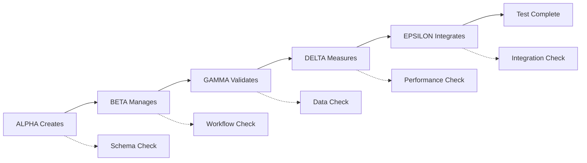

# MULTI-AGENT CRITICAL CLAUDE TESTING FRAMEWORK

## 🤖 AGENT-BASED TESTING ARCHITECTURE

### Agent Roles & Responsibilities

#### 🎯 AGENT ALPHA: Task Creation Specialist
```yaml
Agent ID: CC-ALPHA-TASK-CREATOR
Role: Primary Task Creation & Validation
Specialization: Perfect adherence to Critical Claude task creation patterns

Core Competencies:
- Master all `cc task create` syntax variations
- Generate tasks that perfectly match schema requirements
- Validate task structures before creation
- Handle complex task hierarchies and dependencies

Required Knowledge:
- All valid priority levels (critical, high, medium, low)
- All valid status values (todo, in_progress, done, blocked)
- Proper label formatting and conventions
- Estimated hours validation and best practices
- Assignee format requirements (email preferred)

Testing Scenarios:
1. Basic task creation with minimal options
2. Complex task creation with all options populated
3. Batch task creation for project planning
4. Template-based task generation
5. AI-powered task breakdown creation

Success Criteria:
✓ 100% syntax accuracy for all task creation commands
✓ All generated tasks pass schema validation
✓ Proper handling of edge cases (special characters, long descriptions)
✓ Efficient use of batch operations when appropriate
```

#### 🔍 AGENT BETA: Workflow Orchestrator
```yaml
Agent ID: CC-BETA-WORKFLOW-MANAGER
Role: Task Lifecycle & Workflow Management
Specialization: Complete task lifecycle orchestration

Core Competencies:
- Execute complete task workflows from creation to archival
- Manage task state transitions logically
- Coordinate multi-task operations
- Optimize workflow efficiency

Required Knowledge:
- Valid task status transition patterns
- Task lifecycle best practices
- Bulk operation strategies
- Data export/import workflows
- Backup and recovery procedures

Testing Scenarios:
1. Single task complete lifecycle (create → update → complete → archive)
2. Multi-task project workflow management
3. Task status transition validation
4. Emergency workflow recovery
5. Bulk task operations and cleanup

Success Criteria:
✓ All workflow operations follow logical sequences
✓ No invalid status transitions attempted
✓ Efficient use of bulk operations
✓ Proper error handling and recovery
```

#### 📊 AGENT GAMMA: Data Integrity Guardian
```yaml
Agent ID: CC-GAMMA-DATA-VALIDATOR
Role: Data Validation & Integrity Enforcement
Specialization: Schema compliance and data consistency

Core Competencies:
- Validate all task data structures
- Ensure export/import data integrity
- Monitor schema compliance
- Detect and prevent data corruption

Required Knowledge:
- Complete Critical Claude data schema
- JSON/CSV/Markdown format requirements
- Import/export data transformation rules
- Backup data validation procedures
- Database consistency requirements

Testing Scenarios:
1. Task data schema validation
2. Export/import roundtrip integrity testing
3. Format conversion accuracy validation
4. Backup/restore data consistency
5. Large dataset handling validation

Success Criteria:
✓ All data conforms to Critical Claude schema
✓ Perfect export/import roundtrip integrity
✓ Format conversions maintain data fidelity
✓ No data loss during operations
```

#### 🔬 AGENT DELTA: Performance Validator
```yaml
Agent ID: CC-DELTA-PERFORMANCE-TESTER
Role: Performance Testing & Optimization
Specialization: Command execution efficiency and scalability

Core Competencies:
- Measure command execution times
- Test system performance under load
- Validate resource usage patterns
- Optimize command sequences

Required Knowledge:
- Performance benchmarks for all commands
- Resource usage expectations
- Scalability limits and thresholds
- Optimization strategies
- Load testing methodologies

Testing Scenarios:
1. Single command performance validation
2. Bulk operation scalability testing
3. Large dataset handling performance
4. Concurrent operation handling
5. Memory usage and cleanup validation

Success Criteria:
✓ All commands execute within performance thresholds
✓ System handles large datasets efficiently
✓ Memory usage remains within acceptable limits
✓ No performance degradation over time
```

#### 🔧 AGENT EPSILON: Integration Specialist
```yaml
Agent ID: CC-EPSILON-INTEGRATION-TESTER
Role: System Integration & External Tool Testing
Specialization: End-to-end system integration validation

Core Competencies:
- Test integration with external systems
- Validate CLI-to-service communication
- Test cross-platform compatibility
- Verify deployment scenarios

Required Knowledge:
- Critical Claude architecture components
- External service dependencies
- Platform-specific behaviors
- Deployment environment variations
- API integration patterns

Testing Scenarios:
1. CLI-to-backend service integration
2. File system operation validation
3. Cross-platform compatibility testing
4. External tool integration (git, npm, etc.)
5. Production deployment simulation

Success Criteria:
✓ Seamless integration with all system components
✓ Consistent behavior across platforms
✓ Reliable external service communication
✓ Production-ready deployment validation
```

### 🎭 AGENT INTERACTION PROTOCOLS

#### Multi-Agent Test Orchestration
```yaml
Test Coordination Pattern:
1. ALPHA creates tasks according to test scenarios
2. BETA executes workflow operations on ALPHA's tasks
3. GAMMA validates all data operations performed by ALPHA and BETA
4. DELTA measures performance of all operations
5. EPSILON validates end-to-end integration results

Communication Protocol:
- Agents communicate through standardized test result messages
- Each agent validates the previous agent's work
- Failed validations trigger immediate test failure
- Success chains enable progressive testing complexity
```

#### Agent Validation Chain


### 🧪 TESTING SCENARIOS MATRIX

#### Scenario 1: Basic Competency Validation
```yaml
Test Name: "Basic Task Management Competency"
Agents Involved: ALPHA, BETA, GAMMA
Duration: 5 minutes
Complexity: Low

Test Flow:
1. ALPHA: Create 5 tasks with varying priorities and statuses
2. BETA: Execute status updates on all tasks
3. GAMMA: Validate all task data integrity
4. DELTA: Measure operation performance
5. EPSILON: Verify CLI command execution

Pass Criteria:
- All tasks created successfully
- All status transitions valid
- Data integrity maintained
- Performance within thresholds
- Commands execute without errors
```

#### Scenario 2: Complex Workflow Orchestration
```yaml
Test Name: "Multi-Task Project Workflow"
Agents Involved: All Agents
Duration: 15 minutes
Complexity: High

Test Flow:
1. ALPHA: Create project template with 20+ tasks
2. BETA: Execute complex workflow with dependencies
3. GAMMA: Validate data consistency throughout workflow
4. DELTA: Monitor performance under realistic load
5. EPSILON: Test integration with external tools

Pass Criteria:
- Project workflow completes successfully
- All task dependencies respected
- Data remains consistent throughout
- Performance acceptable for production use
- External integrations work seamlessly
```

#### Scenario 3: Stress Test Validation
```yaml
Test Name: "High-Load Stress Testing"
Agents Involved: All Agents
Duration: 30 minutes
Complexity: Maximum

Test Flow:
1. ALPHA: Create 1000+ tasks rapidly
2. BETA: Execute concurrent operations
3. GAMMA: Continuous data integrity monitoring
4. DELTA: Performance monitoring under load
5. EPSILON: System stability validation

Pass Criteria:
- System handles large datasets without failure
- Performance degrades gracefully under load
- Data integrity maintained throughout stress
- No memory leaks or resource exhaustion
- System recovers properly after stress
```

### 📋 AGENT TESTING CHECKLISTS

#### Pre-Test Agent Validation
```yaml
ALPHA Readiness Check:
□ Can execute all task creation command variations
□ Validates task schema before creation
□ Handles edge cases gracefully
□ Generates realistic test data

BETA Readiness Check:
□ Understands all workflow patterns
□ Can execute complex task operations
□ Handles bulk operations efficiently
□ Manages error recovery properly

GAMMA Readiness Check:
□ Knows complete data schema
□ Can validate all data formats
□ Detects schema violations
□ Monitors data consistency

DELTA Readiness Check:
□ Has performance benchmarks
□ Can measure all operations
□ Monitors resource usage
□ Detects performance regressions

EPSILON Readiness Check:
□ Understands system architecture
□ Can test all integrations
□ Validates deployment scenarios
□ Handles environment variations
```

#### Post-Test Validation
```yaml
Test Result Validation:
□ All agents completed assigned tasks
□ No agent reported validation failures
□ Performance metrics within acceptable ranges
□ Data integrity maintained throughout
□ Integration points functioned correctly
□ System returned to stable state
```

### 🚨 FAILURE DETECTION & RECOVERY

#### Agent Failure Patterns
```yaml
Common Failure Modes:
1. Syntax Deviation: Agent generates invalid CLI commands
2. Schema Violation: Agent creates non-compliant data
3. Workflow Error: Agent executes operations out of sequence
4. Performance Failure: Agent operations exceed time limits
5. Integration Failure: Agent cannot communicate with system

Recovery Protocols:
1. Immediate Test Halt: Critical failures stop all testing
2. Agent Reset: Failed agent reinitializes and retries
3. Cascade Prevention: Prevent failure propagation to other agents
4. State Recovery: Restore system to known good state
5. Failure Analysis: Log and analyze failure patterns
```

#### Automated Recovery System
```typescript
interface AgentFailureRecovery {
  detectFailure: (agent: AgentID, operation: string) => FailureType;
  initiateRecovery: (failure: FailureType) => RecoveryAction;
  validateRecovery: (action: RecoveryAction) => boolean;
  escalateIfNeeded: (failure: FailureType) => void;
}

const recoverFromFailure = async (agent: AgentID, failure: FailureType) => {
  // Stop current test execution
  await haltCurrentTest();
  
  // Reset failed agent
  await resetAgent(agent);
  
  // Restore system state
  await restoreKnownGoodState();
  
  // Retry operation
  const retryResult = await retryOperation(agent, failure.operation);
  
  if (!retryResult.success) {
    await escalateFailure(failure);
  }
};
```

### 🎯 SUCCESS METRICS & KPIs

#### Agent Performance Metrics
```yaml
ALPHA (Task Creator) KPIs:
- Command Syntax Accuracy: 100%
- Schema Compliance Rate: 100%
- Task Creation Speed: <100ms per task
- Edge Case Handling: 100% success rate

BETA (Workflow Manager) KPIs:
- Workflow Completion Rate: 100%
- Operation Sequence Accuracy: 100%
- Bulk Operation Efficiency: >50 tasks/second
- Error Recovery Success: 100%

GAMMA (Data Validator) KPIs:
- Schema Validation Accuracy: 100%
- Data Integrity Maintenance: 100%
- Format Conversion Fidelity: 100%
- Corruption Detection Rate: 100%

DELTA (Performance Tester) KPIs:
- Performance Measurement Accuracy: ±5%
- Load Test Reliability: 100%
- Resource Monitoring Coverage: 100%
- Regression Detection Rate: 100%

EPSILON (Integration Specialist) KPIs:
- Integration Test Coverage: 100%
- Cross-platform Compatibility: 100%
- External Service Reliability: >99%
- Deployment Success Rate: 100%
```

#### Overall System KPIs
```yaml
Critical Claude AI Adherence Metrics:
- 0-Shot Command Accuracy: 100%
- Task Schema Compliance: 100%
- Workflow Logic Correctness: 100%
- Performance Standard Adherence: 100%
- Integration Reliability: >99%
- User Experience Consistency: 100%
```

This multi-agent framework ensures comprehensive testing of AI adherence to Critical Claude CLI standards through specialized agent roles, coordinated testing scenarios, and robust failure detection and recovery mechanisms.