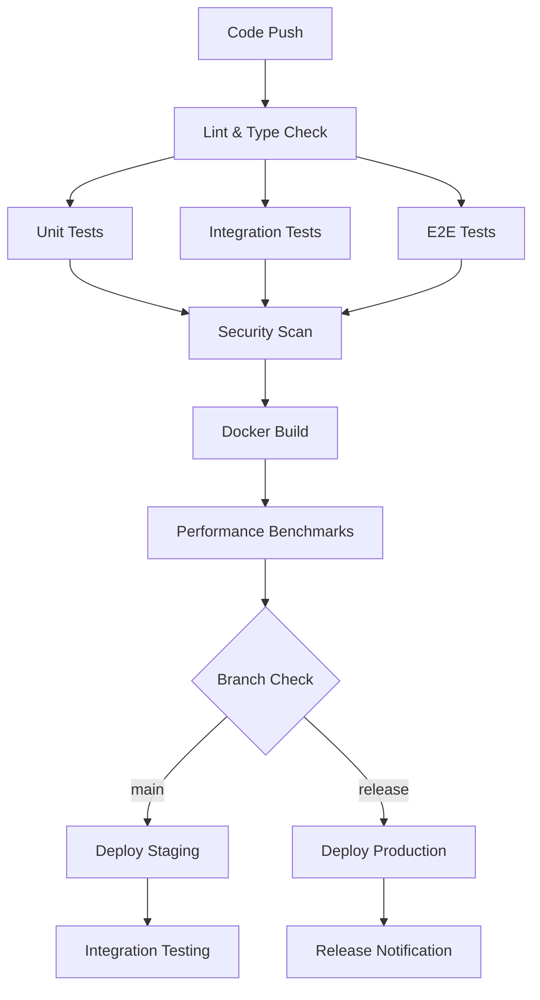

# 🚀 CI/CD Pipeline Documentation

This document describes Critical Claude's comprehensive CI/CD pipeline implemented with GitHub Actions.

## 🏗️ Pipeline Overview

Our CI/CD pipeline ensures code quality, security, and reliable deployments through automated testing, building, and deployment processes.

### Pipeline Stages



## 🔄 Workflows

### 1. Main CI Pipeline (`.github/workflows/ci.yml`)

**Triggers:**
- Push to `main` or `develop` branches
- Pull requests to `main` or `develop`
- Release events

**Jobs:**

#### 🔍 Lint & Type Check
- ESLint code quality checks
- TypeScript type checking
- Prettier format validation
- **Duration:** ~2-3 minutes
- **Fail Fast:** Yes

#### 🧪 Test Suite
- **Unit Tests:** Domain logic validation
- **Integration Tests:** CLI command testing
- **E2E Tests:** Full workflow testing
- **Matrix:** Node.js 18, 20, 22
- **Coverage:** Minimum 70% threshold
- **Duration:** ~5-8 minutes

#### 🔒 Security Scanning
- `npm audit` for dependencies
- Snyk vulnerability scanning
- CodeQL static analysis
- **Duration:** ~3-5 minutes

#### 🐳 Docker Build & Test
- Multi-stage Docker builds
- Image security scanning with Trivy
- Container functionality testing
- **Duration:** ~4-6 minutes

#### ⚡ Performance Benchmarks
- CLI operation benchmarks
- Memory usage analysis
- Performance regression detection
- **Duration:** ~2-3 minutes

### 2. Release Pipeline (`.github/workflows/release.yml`)

**Triggers:**
- Manual workflow dispatch
- Git tag push (`v*`)

**Features:**
- Automated changelog generation
- GitHub release creation
- Docker image publishing
- NPM package publishing
- Slack notifications

## 📊 Testing Strategy

### Unit Tests (`tests/unit/`)

```typescript
// Example: Task Service Tests
describe('TaskService', () => {
  it('should create task successfully', async () => {
    const result = await taskService.createTask({
      title: 'Test Task',
      priority: 'high'
    });
    
    expect(result.success).toBe(true);
    expect(result.task.title).toBe('Test Task');
  });
});
```

**Coverage:**
- Domain entities and value objects
- Application services and use cases
- Business logic validation
- Error handling scenarios

### Integration Tests (`tests/integration/`)

```typescript
// Example: CLI Integration Tests
describe('CLI Integration', () => {
  it('should create and list tasks', async () => {
    const createResult = await runCLI(['task', 'create', '--title', 'Test']);
    expect(createResult.exitCode).toBe(0);
    
    const listResult = await runCLI(['task', 'list']);
    expect(listResult.stdout).toContain('Test');
  });
});
```

**Coverage:**
- CLI command functionality
- Data persistence
- Cross-domain interactions
- File I/O operations

### E2E Tests (`tests/e2e/`)

```typescript
// Example: Viewer E2E Tests
describe('Viewer E2E', () => {
  it('should navigate and search tasks', async () => {
    const session = await startViewer();
    await sendKey(session, '/'); // Open search
    await sendKeys(session, ['t', 'e', 's', 't']);
    
    expect(session.stdout).toContain('search results');
  });
});
```

**Coverage:**
- Full user workflows
- Terminal UI interactions
- Keyboard navigation
- Error recovery scenarios

## 🛡️ Security Measures

### Dependency Scanning
```yaml
- name: Run security audit
  run: npm audit --audit-level=moderate

- name: Snyk security scan
  uses: snyk/actions/node@master
  with:
    args: --severity-threshold=high
```

### Container Security
```yaml
- name: Security scan Docker image
  uses: aquasecurity/trivy-action@master
  with:
    image-ref: 'critical-claude:test'
    format: 'sarif'
```

### Code Analysis
```yaml
- name: CodeQL Analysis
  uses: github/codeql-action/init@v2
  with:
    languages: javascript
```

## 📈 Performance Monitoring

### Benchmark Metrics
- **Command Execution Time:** < 100ms for basic operations
- **Memory Usage:** < 512MB peak for large datasets
- **Throughput:** > 10 operations/second
- **Success Rate:** > 99%

### Performance Thresholds
```javascript
const thresholds = {
  fast: '< 100ms',      // 80% of operations
  medium: '100-500ms',  // 18% of operations  
  slow: '> 500ms'       // < 2% of operations
};
```

### Regression Detection
- Automated performance comparison
- Alert on 50% performance degradation
- Historical trend analysis

## 🚀 Deployment Strategy

### Staging Deployment
- **Trigger:** Push to `develop` branch
- **Environment:** `staging`
- **Validation:** Smoke tests
- **Rollback:** Automatic on failure

### Production Deployment
- **Trigger:** Release tag creation
- **Environment:** `production`
- **Strategy:** Blue-green deployment
- **Approval:** Manual approval required
- **Monitoring:** Real-time health checks

### Rollback Procedures
```yaml
- name: Rollback on failure
  if: failure()
  run: |
    kubectl rollout undo deployment/critical-claude
    docker service update --rollback critical-claude
```

## 📦 Artifact Management

### Docker Images
```yaml
Registry: ghcr.io
Tags:
  - latest (main branch)
  - v{version} (releases)
  - {branch} (feature branches)
  - {sha} (commit hashes)
```

### NPM Packages
```yaml
Registries:
  - npmjs.com (public releases)
  - GitHub Packages (all builds)
Versioning: Semantic versioning (semver)
```

### Release Assets
- Source code archives
- SHA256 checksums
- Docker image manifests
- Installation packages

## 🔧 Local Development

### Running Tests Locally

```bash
# All tests
npm test

# Specific test suites
npm run test:unit
npm run test:integration
npm run test:e2e

# With coverage
npm run test:coverage

# Watch mode
npm run test:watch
```

### Performance Benchmarks

```bash
# Run benchmarks
npm run benchmark

# View results
cat benchmark-results.json | jq .summary
```

### Pre-commit Checks

```bash
# Lint and format
npm run lint
npm run format:check

# Type checking
npm run typecheck

# Build verification
npm run build
```

## 📋 Quality Gates

### Code Quality
- ✅ ESLint: Zero errors, warnings allowed
- ✅ TypeScript: Strict mode, no errors
- ✅ Prettier: Consistent formatting
- ✅ Tests: 70% minimum coverage

### Security
- ✅ Dependencies: No high/critical vulnerabilities
- ✅ Code: No security hotspots
- ✅ Containers: No critical vulnerabilities
- ✅ Secrets: No hardcoded secrets

### Performance
- ✅ Build Time: < 5 minutes
- ✅ Test Suite: < 10 minutes
- ✅ Docker Build: < 8 minutes
- ✅ Deployment: < 3 minutes

## 🚨 Incident Response

### Pipeline Failures

1. **Build Failures**
   - Check build logs
   - Verify dependencies
   - Run locally to reproduce

2. **Test Failures**
   - Review test output
   - Check for flaky tests
   - Validate test environment

3. **Security Issues**
   - Review security scan results
   - Update vulnerable dependencies
   - Apply security patches

4. **Deployment Failures**
   - Check deployment logs
   - Verify infrastructure health
   - Initiate rollback if needed

### Monitoring & Alerting

```yaml
Alerts:
  - Build failures (immediate)
  - Test failures (immediate)
  - Security vulnerabilities (1 hour)
  - Performance regressions (24 hours)

Notifications:
  - Slack: #ci-cd channel
  - Email: dev-team@company.com
  - GitHub: Issue creation
```

## 📊 Metrics & KPIs

### Development Metrics
- **Lead Time:** Time from commit to production
- **Deployment Frequency:** Releases per week
- **MTTR:** Mean time to recovery
- **Change Failure Rate:** % of deployments causing issues

### Pipeline Metrics
- **Build Success Rate:** % of successful builds
- **Test Coverage:** % of code covered by tests
- **Security Score:** Vulnerability count and severity
- **Performance Score:** Benchmark results trend

### Current Targets
```yaml
Lead Time: < 2 hours
Deployment Frequency: 2+ per week
MTTR: < 30 minutes
Change Failure Rate: < 5%
Build Success Rate: > 95%
Test Coverage: > 70%
```

## 🔄 Continuous Improvement

### Regular Reviews
- **Weekly:** Pipeline performance analysis
- **Monthly:** Security posture review
- **Quarterly:** Tool and process evaluation

### Optimization Areas
- Test parallelization
- Build caching strategies
- Container image optimization
- Deployment automation

### Future Enhancements
- Progressive deployment strategies
- Automated rollback triggers
- Advanced monitoring integration
- ML-based failure prediction

---

## 🛠️ Troubleshooting

### Common Issues

**Build Timeouts**
```bash
# Increase timeout in workflow
timeout-minutes: 30

# Check resource usage
docker stats during build
```

**Flaky Tests**
```bash
# Run tests multiple times
npm run test -- --repeat 10

# Check for race conditions
npm run test:integration -- --runInBand
```

**Docker Build Issues**
```bash
# Clear build cache
docker builder prune -f

# Build with verbose output
docker build --progress=plain .
```

For additional support, check the [troubleshooting guide](./TROUBLESHOOTING.md) or contact the DevOps team.

---

*Continuous Integration, Continuous Delivery, Continuous Excellence* 🚀